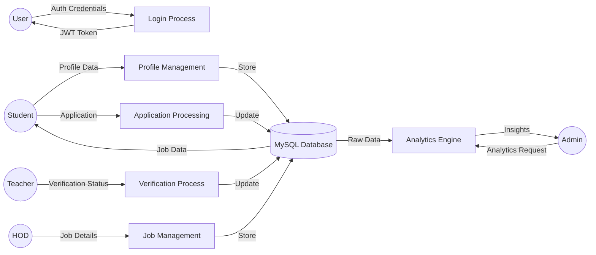

# Campus Nexus: Project Documentation

This document provides a comprehensive overview of the Campus Nexus Placement Portal, including system architecture, diagrams, and functional logic.

---

## 1. Use Case Diagram
This diagram illustrates the interactions between different users (Actors) and the system.

```mermaid
usecaseDiagram
    actor "Student" as S
    actor "Teacher" as T
    actor "HOD" as H
    actor "Admin" as A

    S --> (View Jobs)
    S --> (Apply for Jobs)
    S --> (Update Profile)
    S --> (View Verification Status)

    T --> (Verify Student Resumes)
    T --> (Set Placement Eligibility)
    T --> (Track Applications)

    H --> (Manage Teachers)
    H --> (Approve Student Registrations)
    H --> (Post/Edit Jobs)
    H --> (View Department Analytics)

    A --> (System Wide Analytics)
    A --> (Manage All Users)
    A --> (System Configuration)
    A --> (Global Job Management)
```

---

## 2. Data Flow Diagram (DFD - Level 1)
This diagram shows how data moves between users, processes, and the data store.



---

## 3. Core Functionality Logic

### A. Authentication & Authorization
- **Logic**: Uses JWT (JSON Web Tokens) for secure communication.
- **Process**:
    1. User submits email/password.
    2. Backend verifies against hashed password in MySQL.
    3. If valid, a token is generated containing `userId` and `role`.
    4. Frontend stores token and uses it in the `Authorization` header for all API calls.

### B. Student Verification Workflow
- **Logic**: A multi-stage approval process ensures data integrity.
- **Process**:
    1. **Registration**: HOD must approve a student's account before they can log in.
    2. **Resume Verification**: Teacher reviews the uploaded resume and marks it as `Approved` or `Needs Revision`.
    3. **Eligibility**: Teacher sets eligibility based on academic criteria (CGPA/Training).
    4. **Application**: Only "Eligible" students with "Approved" resumes can apply for jobs.

### C. Job Matching & Analytics
- **Logic**: Department-based filtering and status aggregation.
- **Process**:
    1. Jobs are posted with `allowed_departments`.
    2. Frontend filters jobs so students only see those relevant to their department.
    3. Analytics engine runs SQL queries using `GROUP BY` and `COUNT` to generate real-time placement rates and status breakdowns.

---

## 4. Project Structure & File Purposes

### Backend (`/backend`)
| File/Folder | Purpose |
| :--- | :--- |
| `server.js` | Entry point; configures Express, Middleware, and Routes. |
| `db.js` | Database connection logic using MySQL2 pool. |
| `routes/` | Contains API endpoints (Auth, Jobs, Profiles, Analytics). |
| `middleware/` | Logic for verifying JWT tokens and role-based access. |
| `.env` | Sensitive configuration (DB credentials, JWT secret). |

### Main Application (`/react-frontend`)
| File/Folder | Purpose |
| :--- | :--- |
| `src/context/` | State management (AuthContext for user, DataContext for API calls). |
| `src/pages/` | Individual dashboard views (Student, Teacher, HOD, Admin). |
| `src/components/` | Reusable UI elements (Navbars, Modals, Tables). |
| `vite.config.js` | Build tool configuration (Ports, Plugins). |

### Landing Page (`/landing-page`)
| File/Folder | Purpose |
| :--- | :--- |
| `src/app/` | Next.js App Router pages (Hero, Stats, Job Showcase). |
| `src/components/` | High-performance UI components using Framer Motion/GSAP. |
| `package.json` | Project dependencies and startup scripts (Port 3001). |

---

## 5. Technology Stack
- **Frontend**: React (Vite), Next.js (Landing Page), Framer Motion (Animations).
- **Backend**: Node.js, Express.
- **Database**: MySQL.
- **Security**: JWT, Bcrypt.
